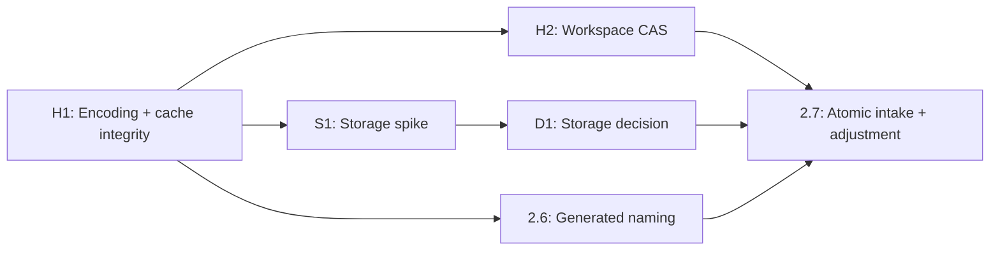

# Element 10 — Roadmap (revised)

Updated: 2026-07-14 (rev 3: Phase 6–11 subpasses restored; mutation-level idempotency contract added to 2.7; immediate queue rendered as a dependency graph; cross-cutting verification made proportional). This document supersedes the original roadmap. Progress is measured by whether a business action is **authoritative, recoverable, idempotent, and reconcilable** — not by whether a screen exists.

## Product direction (recorded 2026-07-15)

Element 10 will eventually be **productized (multi-tenant SaaS) and verticalized across industries** beyond trading cards. Consequences, in force from now:

1. **Tenancy is a decision gate, not a surprise.** The entire system currently assumes one organization (`e10_workspace.id='shared'` is singular; every RLS policy means "member of THE team"). The tenancy architecture decision (org model, per-org workspace rows, policy rewrite, storage/realtime partitioning) is added to the 2.12 checkpoint, and the migration itself runs as a dedicated pass **before the first external user** — not before Phase 3. Trent's operation is tenant zero; dogfood-first stands.
2. **Hygiene now, abstraction later.** New code must not multiply single-org assumptions: new tables and RPCs reference workspace/org through helpers, never fresh hardcoded `'shared'` literals. But NO generic multi-vertical engine gets built yet — the same Whatnot-first rule in the coding standards applies to verticals: model extensibly, implement cards only. The generalizable core is already emerging on its own (inventory + cost basis + reservations + append-only consumption ledger + live-event selling + marketplace reconciliation + fulfillment); breaks/checklists/players/teams are the first vertical's modules. Phase 3 should NAME its primitives with that split in mind, not build a config layer.
3. **Frontend path (revised again 2026-07-15 — CONTROLLED REPLATFORM, supersedes the in-place extraction plan):** the current frontend's workflows are acknowledged as wrong (page-thinking, not outcome-thinking; context lost between modules), so refactoring it in place would preserve bad navigation in better-organized code. Instead: **(1) UX prototype pass NOW** — workflow inventory → information architecture (which concepts are first-class: org, show, session, inventory, order, fulfillment) → navigation/shell prototype (contextual nav, queues, next-action) → clickable prototypes of the 5 critical journeys (prepare show → reserve → start live from show → consume/correct/reverse → close and reconcile), each documenting start point, outcome, required info, decisions/interruptions, module transitions, completion state, next action; validated first against Trent's real operation. First vertical only; no workflow configurator. **(2) SaaS foundation** — tenancy-aware shell, environments, TypeScript contracts, routing, state boundaries, CI. **(3) Vertical-slice implementation** of one validated journey against the proven backend. **(4) Progressive migration**, retiring legacy surfaces as their journeys land. **The current frontend becomes:** visual reference, behavioral/calculation oracle, functionality inventory, and operational fallback — NOT the navigation specification. **Freeze policy:** once the first new-shell journey ships, the old app is critical-fix-only, and all Phase 3+ surfaces land new-shell-only. **Consequence:** 2.10/2.11 are designed in the prototype pass and built inside the new shell's close-and-reconcile journey, not as index.html modules; Phase 2's remaining plumbing (M4 reconciliation, 2.12 incl. tenancy decision) still closes in the current world. Design work runs in PARALLEL with — never instead of — the incident closure and INF1 safety items, which the new frontend needs just as much.

4. **THE FOUNDATION GATE — REVISED ORDER (2026-07-15 second revision; supersedes the FG1–FG9 numbering below and INF1).** Adopted corrections: safety rails moved EARLY (CI/monitoring/backups are prerequisites for tenant migration and meaningful stress testing — detecting failure without evidence to explain it is not testing); an explicit scale-target definition step added; cross-track dependencies made explicit.

   **Track A order (authoritative):**
   1. **Save the canonical database blueprint** — capture all 46 live migrations (repo has 13); prove an empty database rebuilds via `supabase db reset`.
   2. **Create local + staging environments** — production stops being the default integration-test target.
   3. **Install the initial safety rails** — CI, environment guards, migration checks, RLS tests, advisor checks, monitoring, backup configuration. (Moved from last to third, deliberately.)
   4. **Finish the security + performance sweep** — storage listing policy, leaked-password protection, privileged-function audit, RLS InitPlan warnings (14), missing FK indexes (5). P0 recon-view leak already fixed and verified (advisor: zero errors).
   5. **Define the scale target** — registered/active users, concurrency, org count, writes/sec, realtime audience size, dataset growth, latency targets, acceptable error rate. Load tests mean nothing without this.
   6. **Build the tenant spine in staging** — full spec, not an account selector: `organizations`, memberships + invitations, org-scoped roles/capabilities, platform admins SEPARATE from customer-org admins, tenant-zero backfill, `organization_id NOT NULL` on all tenant-owned data, tenant-scoped RLS/RPCs/storage/realtime/idempotency `(org_id, key)`, module entitlements for vertical functionality, and the global-reference vs tenant-owned data classification.
   7. **Prove isolation** — two hostile test orgs across every table, RPC, view, storage path, realtime channel.
   8. **Bound data access** — cursor pagination, server-side filtering, query indexes, bounded movement history, remove full-inventory loading (`e10_inv_list`).
   9. **Realtime scale strategy** — org-filtered operational subscriptions; Broadcast for high-fanout live audiences.
   10. **Load, recovery, production cutover** — 2× defined workload in staging, restore drill, migrate production to tenant zero, verify reconciliation.

   **Track B order:** 0. Workflow inventory + complaints (Trent's homework — everything depends on it) → 1. Domain + module map, classifying every concept as core-SaaS / tenant-owned / global-reference / vertical-specific → 2. Navigation prototype → 3. Five critical journeys → 4. Realistic usability test → 5. Tenant-aware app skeleton → 6. First complete working slice → 7. Progressive migration.

   **Cross-track dependencies (binding):** Track B steps 0–4 run in parallel with Track A 1–5. The **app skeleton (B5) waits for a stable org/membership contract (A6)**. The **first slice (B6) waits for isolation proof (A7)**. **Progressive migration (B7) waits for bounded APIs, realtime strategy, CI, and staging verification (A8–A9 + A3)**. Production cutover (A10) precedes broad migration.

   **Status notes (2026-07-15):** M4 is COMPLETE and closed — relational inventory authoritative, blob retired, M4 report + recovery procedure verified by review; the "unexplained switchover" blocker is resolved; its documentation consolidates into the blueprint pass (A1). The live-break consume/reverse click-through is reclassified as a **non-blocking operational smoke test** — do it when convenient; it no longer gates foundation work.

   ~~Original FG1–FG9 numbering below, retained for reference:~~ Verdict on record: the system CAN support thousands of users on Supabase/Postgres — pooled row-level multi-tenancy, no microservices/sharding needed — but ONLY after this gate. The feature roadmap pauses at the gate; UX prototyping (Track B) continues in parallel; **no new production modules are built on the old global model.** The nine gates:
   - **FG1 Security closure.** ✅ P0 FIXED 2026-07-15 (DB-verified): M4's read-source migration recreated `e10_inventory_recon`/`e10_inventory_reserved_recon` as SECURITY DEFINER views with `anon` SELECT — unauthenticated internet access via the shipped anon key. Hotfixed by migration `e10_p0_recon_view_security` (invoker semantics + anon revoked); the file must be committed to the repo verbatim. Remaining: storage-listing policy review, leaked-password protection, disposition every privileged-function warning.
   - **FG2 Reproducible database.** CONFIRMED: production has 45 applied migrations; the repo holds 13. An empty project cannot be rebuilt from the repository — bigger foundation risk than the frontend monolith. Capture the complete live schema/policies/functions/grants/auth/storage config; `supabase db reset` must produce a working environment.
   - **FG3 Environment separation.** Local + staging + production; tests never default to production.
   - **FG4 Tenant spine (in staging).** `organizations`, `organization_memberships`, invitations, modules, entitlements; `organization_id NOT NULL` on every tenant-owned table (workspaces, inventory items, reservations, movements, receipts, shows, sessions, slots/events, checklists, orders); existing text item ids preserved via `(organization_id, id)` PK or UUID + `UNIQUE(organization_id, legacy_id)`; idempotency scoped `(organization_id, key)`; roles/capabilities org-scoped; `is_org_admin(org)` replaces global admin; every RPC validates org membership; every policy and index leads with `organization_id`; realtime and storage paths org-scoped; platform admins separate from customer-org admins. **Data classification decided here:** platform reference (sports/leagues/canonical teams/cards) vs tenant-owned vs vertical modules vs personal preferences. This absorbs 2.12's tenancy decision.
   - **FG5 Isolation proof.** Two orgs in staging; adversarial cross-tenant denial tested on every table, RPC, view, storage path, and realtime channel.
   - **FG6 Bounded reads.** `e10_inv_list()` returns the entire catalog to any member — replace with filtered, cursor-paginated reads; movement history (2.10) is built on the new contract, never the old one. Fix the 14 non-InitPlan RLS policies and 5 unindexed FKs the performance advisor reports.
   - **FG7 Realtime design.** Org-filtered subscriptions for operational updates; Broadcast (not Postgres Changes) for high-fanout live-event experiences per Supabase's ~3,000-subscriber guidance.
   - **FG8 Load proof.** Define the target workload; run ≥2× target in staging; measure API/mutation latency, DB CPU, connections, realtime delivery, errors, recon drift.
   - **FG9 Operational proof.** CI runs migrations, RLS tests, contract tests, browser flows pre-deploy; backups, PITR, alerting, restore drills, rate limits per Supabase's production checklist.

**Incident CLOSED (2026-07-15):** the M4-adjacent local-client write against production was investigated; M4 was subsequently completed properly — relational inventory is authoritative, the blob is retired, the deployed client reads rows, the recon views' security regression was caught and hotfixed (`e10_p0_recon_view_security`, advisor now zero errors), and the M4 report + recovery procedure were verified in review. Residual lesson institutionalized as Track A steps 2–3 (environments + safety rails): local clients must never be able to mutate production. M4 documentation consolidates into the blueprint pass (Track A step 1).

Unchanged by this decision: the immediate queue (observation window → click-through → P2R → M4 gate → 2.10–2.12), and the entire database layer — relational entities, transactional RPCs, ledger, RLS, receipts all carry into the product intact.

## Sequencing principles

1. **Ship before refine.** Live defects outrank sequencing debates. Four review rounds grew the pass count 6 → 9 without shipping; the immediate queue reverses that.
2. **Price decisions before paying for their alternatives.** The storage question (inventory in the `shared` JSON blob vs relational rows) is decided BEFORE building INVENTORY-specific concurrency machinery, because that machinery is the cost of the blob. But the distinction matters: generic workspace compare-and-swap (H2) is NOT gated on the storage decision. Todos, comments, checklists, shows, breaks, and the rest of the shared/scoped documents stay in workspace rows under every D1 outcome, and `writeRow()` is blind for all of them. A relational inventory migration deletes the inventory-specific conflict machinery; it does not fix a todo save clobbering a checklist edit.
3. **Storage-agnostic contracts.** The transactional mutation RPC surface (intake / adjust / reserve / release / consume / reverse) survives either storage outcome; only its internals change. Either way, the authoritative inventory mutation and its movement commit in ONE PostgreSQL transaction — no outbox, no pending-emission states. Both stores live in the same database; outboxes are for cross-system boundaries that don't exist here.
4. **Reliability gates between feature surfaces:** atomicity before emission, reconciliation after emission, lifecycle contracts before presentation, metric contracts before dashboards.

---

## Immediate queue and dependencies

H2, S1, and 2.6 run in parallel after H1. D1 waits on S1 only. 2.7 waits on D1, H2, and 2.6.

| # | Item | Status |
|---|------|--------|
| H1 | **Hotfix: context-aware output encoding + write-cache integrity.** Encode every dynamic value for its context (HTML text, HTML attribute, inline-JS string, URL); commit `_lastShared`/`_lastScoped`/`REVS` only on successful write; failure toast. Establishes the pure-helper test convention (T1 folded in: first `tests/` unit tests land here). Keepalive flush cut — page-exit durability is a flagged follow-up, pursued only if reproduced as a defect. Prompt: `Element10_BUILD_PROMPT_hotfix_escaping_writecache.md` | **SHIPPED** `7c8d546` |
| H2 | **Workspace compare-and-swap integrity.** Replace blind workspace upserts with rev-conditional updates for the shared AND scoped rows. Advance `REVS` and write caches only on confirmed success (H1 groundwork). On conflict: the stale write fails, local unsaved state is preserved, current remote state is fetched, and the user gets retry/review. Detection-first — the critical result is that stale writes stop succeeding silently; merge tooling stays modest. Storage-independent: needed under every D1 outcome (see principle 2). | **SHIPPED** `1ed1e96` — CAS via conditional UPDATE, pure section-level three-way merge (`tests/merge_test.js`, 11 pass), Keep-mine/Take-theirs conflict UX, in-flight guard, `cloudCommitShared` converted. Two-tab tests 1–5 green, gate 0 HARD, deltas 0. |
| S1 | **Storage spike (half day, read-only, no migration).** Price per-entity inventory rows vs blob + inventory-specific machinery. Measure: every read and every mutation of `S.inventory`; which code requires synchronous access; which functions could use an in-memory relational cache and how realtime patches it; how stable JSONB ids map to relational PKs (the ledger's `item_id text` keying already demonstrates it); how reservations are represented (inventory row + child reservation rows vs array); legacy JSON rollback; and which shared-document write risks REMAIN after inventory moves (they feed H2/2.7 scope, not the decision). Output: which passes each option deletes, shrinks, or keeps. Compare total implementation cost, not row count. Context (DB-verified 2026-07-14): 35 inventory rows in a blob vs 57.3k cards + 7 other entities already relational with working RLS; the emit RPC is shipped and becomes internal to the 2.7 mutation RPCs. | **DONE** — `Element10_SPIKE_storage_decision.md`. Priced: (a) migrate 6–10 days, (b) blob machinery 2–3 days + permanent ceiling, (c) contracts-first 3–5 days. Recommends (c), with an explicit rule: "if 2.8/2.12 are the very next passes, jump to (a)." |
| D1 | **Storage decision gate.** Choose with S1's numbers: (a) migrate inventory items to relational rows, (b) keep blob + build the inventory-specific concurrency machinery, or (c) keep blob short-term with RPC contracts designed for later migration. This replaces the old plan of deferring the decision to 2.12. | **DECIDED 2026-07-14: (a) migrate now.** Trent's call, following the spike's own rule (2.8 imminent; reservations are the strongest relational case, §5). Consequences: inventory items → `e10_inventory_items` (PK = existing text id, per §4), reservations → child rows (§5), staged dual-write with the §6 rollback plan, blob-side 2.7a machinery deleted. Execution: `Element10_BUILD_PROMPT_chainM_inventory_migration.md`, which absorbs 2.7–2.9. |

**Honest caveats carried forward:** relational inventory means async reads everywhere or a client cache that reintroduces (row-granular, tractable) staleness — that cost is real and is exactly what S1 measures. S1 is a bet, not a guarantee: if the refactor prices too high, the half day is spent and the passes remain. And H2 does not block S1 — S1 is read-only analysis with no dependency on the write path; serializing them buys nothing.

---

## Phase 2 — Inventory foundation and experience (IN PROGRESS)

| Pass | Scope | Status |
|------|-------|--------|
| 2.1 | Ledger and opening balances | COMPLETE |
| 2.2 | Row interaction and dismissal | COMPLETE |
| 2.3 | Field-model reconciliation | COMPLETE |
| 2.4 | Compatibility helpers and Type column | COMPLETE |
| 2.5 | Type-aware Add/Edit form (`93a9161`) | COMPLETE |
| 2.6 | **Generated naming** — includes form-correctness prerequisites as acceptance criteria, not separate passes: linked records opening falsely dirty; linked-card metadata state (load from `cardId` into UI state; generator stays pure; loading must not overwrite Name; failed load omits subject; never parse existing Name to recover the subject); Edit type-switch cleanup; single active save path confirmed; focused pure-helper tests. HTML-escaping prerequisite is satisfied by H1. Caution: keep the generator and form state storage-agnostic — no deeper coupling to `S.inventory` than the existing form already has, so a later relational D1 doesn't strand it. Prompt: `Element10_BUILD_PROMPT_pass26_generated_naming.md` | **NEXT — unblocked** (H1 shipped; does not wait on D1) |
| 2.7 | **Atomic intake and adjustment movements.** Gated on D1; builds on H2's CAS. **Required (no interim option):** transactional mutation RPCs (`e10_inventory_intake/adjust/...`) that validate, apply the inventory mutation, append the movement, and commit in ONE PostgreSQL transaction, returning rev + movement ID. Client retries carry a stable idempotency key and return the previously committed result. If D1 = blob, the RPC locks and updates the shared inventory document; if relational, it updates a row. **Mutation-level idempotency contract** (the existing emitter's replay-returns-existing-movement-ID is necessary but NOT sufficient — a wrapper that mutates inventory first and then calls the emitter would mutate twice on replay while the movement stays singular): (1) acquire the inventory lock; (2) check the idempotency key BEFORE applying the mutation; (3) if already committed: no inventory mutation, return the existing movement ID plus current authoritative state and revision; (4) if new: validate expected state, apply the mutation, append the movement, increment the revision, commit together; (5) return committed item, revision, movement ID. **Legacy write-path cutover is part of this pass:** once RPCs own inventory, the generic `doCloudWrite()` payload must stop carrying `inventory` (blob: strip the field / CAS-protect it; relational: it's gone from the doc) — otherwise a stale client save clobbers RPC-committed inventory. **Embedded reconciliation acceptance:** operational on-hand equals ledger-derived on-hand after intake and adjustment; a retried mutation produces exactly one mutation and one movement; **replaying a committed idempotency key performs zero additional inventory mutation and emits zero additional movement rows.** | **LIVE via Chain M** — M1 `7f4789f` (schema + shadow, zero drift), M2 `1b72f88` (8 transactional RPCs, mutation-level idempotency proven by replay, `imov_ins` revoked), M3 `1432829` (client cutover, dead paths deleted, H2 non-clobber proven). DB-verified 2026-07-14: drift 0 on all 35 items, ledger SELECT-only. **M4 ON HOLD.** M3.1 hardening built on branch `m31-hardening` (M3.1a `3a85b39` DDL — applied LIVE; M3.1b `8ea5bc0` client — unpushed). Audit 2026-07-14: 7 blockers + 8 amendments substantially verified in DB; three pre-merge items: (1) `e10_inv_add_item` has no same-key serialization (no advisory lock anywhere; row locks cover the other 8 — concurrent add gets a raw constraint error, not replay-success), (2) stopped-run test users still present despite claimed deletion, (3) committed default test credentials → env vars. **Split RESOLVED: M3.1 merged + deployed (`1a97df7`); M3.2 shipped (`2307867`) — show-born sessions carry `source_show_ref` and consumption draws the show's reservations, RPC-level E2E proven.** **M3.2.1 SHIPPED** (`c61d64e` + `860eae2`, deployed; DB-verified). **Correction to the record:** M3.1 already serialized same-key mutations — the advisory lock lived in the helper `_e10_inv_receipt_check`, which every RPC called before mutating; the earlier audit's grep excluded underscore-prefixed helpers and produced a false negative, and the "skipped and misreported" accusation against the M3.2 report was wrong. M3.2.1's real additions: per-body lock auditability + different-key `unique_violation` handling, plus the show-ref safety items (inference deleted, seed lifecycle, server-side derive/validate). **M3.2.2 SHIPPED (`1f58c0e` + `dc6e99d`) — audit clean; M3 chain CLOSED.** All six closure items verified in DB/tests; gate under Trent-supplied credentials. Remainder of Phase 2: **Chain P P0–P2 was BLOCKED in review** (7 findings: preview wired to only 2 of ~12 inputs; boolean flag instead of the tri-state absent≡preserved model + wrong property name; generator duplication/minimum-usefulness/card-number/lot failures; cleanup backdoor narrowed not removed — reviewer standard adopted: NO production ledger-delete RPC for anyone, teardown via service role; M3.2.2 down-block was pseudocode with an ellipsis; P2 was a projection diff, not a write-back rehearsal — the weak spec was the orchestrating prompt's fault; and zero non-opening movements = no observation window has ever occurred). **Corrective pass: `Element10_BUILD_PROMPT_chainP_corrective.md`** (P0R drop cleanup RPC + executable down-block proven by apply-assert-rollback → P1R 2.6 corrections: full wiring, tri-state `custom_name_override`, dedup/minimum/card-number/lot rules, falsy-flag clobber test + live-board picker id-collision fix and full live-board browser test, items 6–7 — Trent's first production click-through failed at step 4 on duplicate `#epi_prodPick` ids; steps 1–3 passed and the ledger's first real movements were recorded → deploy → REAL observation window incl. Trent's click-through RETRY through consume/reverse → P2R scratch-row write-back rehearsal under an explicit equivalence contract) → **⏸ "M4 approved"** → P3–P6 of the close-out chain (P2 section superseded by P2R). Naming decision on record: `custom_name_override` supersedes the prompt file's `name_is_custom` example. Attach semantics decision: all-or-nothing model attach accepted (partial attach was silent under-reservation). |
| 2.8 | **Atomic reservation and release movements.** Acceptance: operational reservations equal ledger-reserved totals; reserve/release retries do not duplicate state. | **LIVE via Chain M** (reservation child rows; `reservation`/`reservation_release` movements; SET semantics on model attach/detach). **Open flag (escalated to M3.1 blocker):** `e10_inv_release` is team-wide with no `created_by` check — a server-side authorization regression, fixed in M3.1, not M4. |
| 2.9 | **Atomic break consumption and reversal.** Acceptance: consumption and reversal reconcile; one movement can be reversed at most once. | **LIVE via Chain M** (`break_consumption`/`break_reversal` with LIFO reversal, `p.consumed` exact, double-reversal rejected). |
| 2.10 | Movement-history UI | **NEXT after M4** — the ledger now accumulates real movements. |
| 2.11 | **Inventory integrity report and controlled corrections (narrow).** Report ledger-vs-operational drift, orphan IDs, and invalid movement relationships. Corrective movements (never edits to history, explicit approval required) only for drift scenarios actually observed or deliberately reproduced. No pending-emission retry system — transactional mutations make that state abnormal by construction; the day-to-day reconciliation guarantees live in 2.7–2.9 acceptance. | |
| 2.12 | **Inventory storage and scaling checkpoint.** Not an authority review — D1 already made the authority call well enough to build the mutation layer. Evaluate with production evidence: shared-row lock contention, inventory read performance, mutation latency, client-cache complexity, reconciliation results, operational volume, and whether the stable RPC interface permits a low-risk internal migration. Performance measured at current and 10× volume. **Per the product direction (2026-07-15), 2.12 additionally carries the TENANCY architecture decision:** org model, per-org workspace rows, RLS policy rewrite scope, storage/realtime partitioning, and the recommended timing of the tenancy migration pass (before first external user). It also inventories every hardcoded single-org assumption (`'shared'` literals, `e10_is_member` semantics, bucket paths) as the migration's work list. | |

---

## Phase 3 — Break Planner workflow (reframed: lifecycle, not presentation)

The planner's functional surface (products, checklist inputs, spot generation, tiering, viability projections, schedule attachment, allocation, live handoff) largely exists. The gap is controlled lifecycle and persistence.

- **3.1 Workflow state model:** Draft → Valid → Approved → Scheduled → Started → Completed / Cancelled-voided.
- **3.2 Versioned plan snapshot:** on schedule/start, freeze products, quantities, costs, spots, tiers, pricing assumptions, checklist/set references, allocations. Later edits never silently rewrite historical assumptions.
- **3.3 Plan-to-session handoff:** reserve inventory, validate availability, create the session from the approved snapshot, prevent duplicate creation, make substitutions explicit, release unused inventory on cancellation.
- **3.4 Economics reconciliation:** distinguish modeled revenue, E10-recorded hammer totals, imported Whatnot actuals, and reconciled results. Aligns with 2.8/2.9.

## Phase 4 — Home and operating workflow

Home summarizes authoritative state; it never re-derives readiness with a second rule set. Readiness contract: scheduled show exists; break model valid; required inventory reserved; checklist relationships valid; no unresolved drift; operator/streamer assigned; session not completed/cancelled.

## Phase 5 — Targeted navigation review (gate, not rebuild)

Substantial navigation restructuring already shipped. Compare current nav to intended destinations, measure Breaks discoverability, find duplicate/ambiguous destinations, make only necessary label/placement changes. Do not restructure twice because the roadmap contains a navigation phase.

## Phase 6 — Player master-data quality

- **6.0 Source provenance (new prerequisite):** for important fields, record imported file/batch, checklist/set, manual edit, inferred, normalized, authoritative override. A practical import-batch + source-reference model — not full event sourcing. Merge previews must show why a value exists and which import would reintroduce it.
- **6.1 Player-quality reporting**
- **6.2 Player merge workflow**
- **6.3 Player split and aliases**

## Phase 7 — Checklist and grid improvements

- **7.1 Players grid**
- **7.2 Teams grid**
- **7.3 Buy List grid**
- **7.4 Reporting and checklist-quality surfaces**

**The authoritative fulfillment grid is removed from this phase and moves to 8.6** — building it before the normalized order model exists means designing around provisional live-break buyer state and rebuilding it later. A provisional live-break fulfillment view may remain, labeled operational, not marketplace-authoritative.

## Phase 8 — Whatnot Weekly Orders pipeline

Execution sequence (restored from the original roadmap): 8.1 export inspection (source + spec); 8.2 raw and normalized schemas; 8.3 upload / validation / preview; 8.4 transactional commit; 8.5 show/break/product reconciliation; 8.6 authoritative fulfillment grid (moved here from Phase 7).

Two hard rules layered on top: never overwrite the original uploaded file or parsed source rows — corrections create a new normalized interpretation or import revision. Preserve four identifiers: import batch ID, source row ID, marketplace order ID, marketplace line-item ID. Order ID alone is not the stable unit for refunds, cancellations, or partial fulfillment.

## Phase 9 — Customers

- **9.1 Canonical customer and alias schema**
- **9.2 Customers UI**
- **9.3 Customer merge and alias management**

Constraints across all three: canonical identity derives from platform identity + alias history — never from mutable shipping details (those are sensitive fulfillment attributes, not durable keys). Restricted PII access, retention rules, auditable merges, no PII exposure through overlays or general team reporting.

## Phase 10 — Authoritative Home revenue

**Metric contracts first.** For each metric: source, grain, included statuses, refund treatment, fee treatment, shipping treatment, time basis, freshness, and whether it is projected, recorded, imported, or reconciled. "Gross sales," "revenue," "hammer," and "net proceeds" are never interchangeable labels.

Intended metrics: gross sales; net proceeds where supported; fees; refunds; cancellations; reconciled COGS; realized gross profit; order count; customer count; new vs repeat buyers. Imported actuals, manual session records, modeled projections, and reconciled results stay explicitly separate.

## Phase 11 — Analytics

Same metric contracts as Phase 10 — they remain the prerequisite.

- **11.1 Stream profitability**
- **11.2 Product profitability**
- **11.3 Break modeled vs actual**
- **11.4 Customer lifetime spend**
- **11.5 Cohort and affinity analytics**

## Phase 12 — Final navigation expansion

Dependent on trustworthy modules.

---

## Cross-cutting engineering track (every remaining pass, not a numbered phase)

The app is a large single-file frontend with transactional behavior distributed across many functions — a material risk. Verification is proportional to what a pass touches: pure-helper tests where applicable; browser verification for changed UI behavior; RLS and migration verification for server changes; retry and duplicate-action tests for mutations; concurrent-edit tests when shared, scoped, cached, or transactional state changes (generated string formatting doesn't need one; workspace CAS and inventory mutation absolutely do); production baseline checks when production-shaped data is involved. Every pass, regardless: remove obsolete competing code paths and document the authoritative mutation function.

No framework rewrite. Extract seams as they become critical: escaping (H1), form state (2.6), inventory mutations + movement emission (2.7–2.9), break lifecycle (3.x), order import (8), metric definitions (10).
